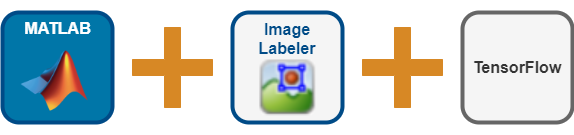
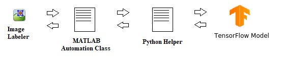
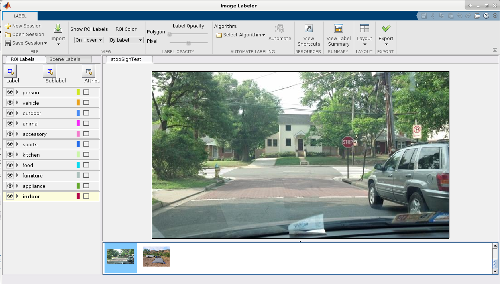
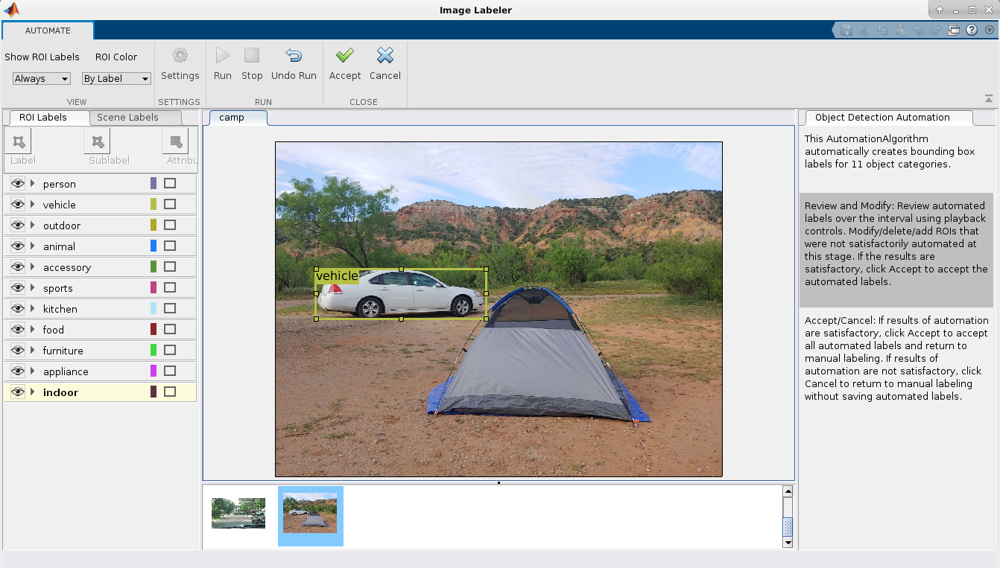
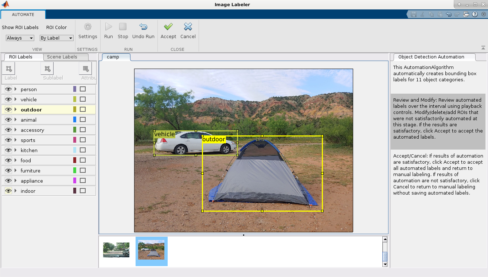

# Automate Labeling in Image Labeler using a Pretrained TensorFlow Object Detector


This example shows how to automate object labeling in the Image Labeler app using a TensorFlow&trade; object detector model trained in Python&reg;. 




## Requirements 

- MATLAB&reg; R2021a or later 
- Computer Vision Toolbox&trade;
- Python&reg; 3.7+
- TensorFlow&trade; 2+

For more information about Python, see [Install Supported Python Implementation](https://www.mathworks.com/help/matlab/matlab_external/install-supported-python-implementation.html). For more information about TensorFlow including installation instructions see, [https://www.tensorflow.org/install](https://www.tensorflow.org/install).

## Overview
  


The [Image Labeler app](https://www.mathworks.com/help/vision/ref/imagelabeler-app.html) provides an easy way to interactively label data for training image classifiers, object detectors, semantic segmentation networks, and instance segmentation networks. It supports several built-in automation algorithms and provides an interface to define custom automation algorithms to accelerate the labeling process. Custom automation algorithms allow access to pretrained models not yet available in MATLAB.


This repository demonstrates the use of a custom MATLAB automation algorithm that incorporates an object detector trained in Python. To co-execute the object detector in Python, a set of Python functions is required to load, run, and retrieve results from the object detector.  These functions are called by the automation algorithm to enable the co-execution of the TensorFlow object detector within the Image Labeler app. The interaction between the Image Labeler,  Automation class, and the Python file is captured in the following illustration:                           




For further details on co-execution, see this example: [MATLAB Calling TensorFlow for Image Classification](https://github.com/matlab-deep-learning/Image-Classification-in-MATLAB-Using-TensorFlow). Note that the procedure shown in this example can be replicated to write automation algorithms for the [Video Labeler](https://www.mathworks.com/help/vision/ref/videolabeler-app.html) and [Ground Truth Labeler](https://www.mathworks.com/help/driving/ref/groundtruthlabeler-app.html) apps. 


  


## Setup

The script `checkPythonSetup` contains commands to help set up the python environment. For more information on setting up or troubleshooting the Python Environment in MATLAB see [Calling Python from MATLAB](https://www.mathworks.com/help/matlab/call-python-libraries.html)

Interacting and generating predictions using the TensorFlow model require a Python helper file to load the deep learning model, perform any TensorFlow specific pre-processing and generate predictions. The Python helper file for this example is named `pyUtil.py`. 

In this example, you will be using a TensorFlow model but it can be easily replaced with a PyTorch&trade; model with corresponding modifications in the Python helper file.

## Download the pre-trained model
  

The pre-trained model that you will be using for this example is EfficientDet-D1. This pre-trained model is trained on the [MS-COCO dataset](https://cocodataset.org/) and can identify 91 different objects and its input size is 640x640. The model can be downloaded from the following link: [https://tfhub.dev/tensorflow/efficientdet/d1/1?tf-hub-format=compressed.](https://tfhub.dev/tensorflow/efficientdet/d1/1?tf-hub-format=compressed.) The function `downloadModel` downloads the model in the present working directory.


```
>>downloadModel
```

For simplicity, you will reduce 99 classes to 11 super-classes in the automation algorithm. 


## The Automation Algorithm

Incorporating Python helper script in the Image Labeler app requires an automation class in MATLAB that inherits from the abstract base class [`vision.labeler.AutomationAlgorithm`](https://www.mathworks.com/help/vision/ug/create-automation-algorithm-for-labeling.html). This base class defines the API that the app uses to configure and run the algorithm. The Image Labeler app provides a convenient way to obtain an initial automation class template. For details, see [Create Automation Algorithm for Labeling](https://www.mathworks.com/help/vision/ug/create-automation-algorithm-for-labeling.html). The `ImageLabelerAutomation` class is based on this template and provides a ready-to-use automation class for object detection. This file is in `+vision/+labeler` folder under the current working directory. 


## Executing the Automation in the Labeler

Now you can load images and start labeling them.

   -  For simplicity, the function `generateGroundTruth` creates a groundTruth object with sample images and a set of label definitions. The groundTruth object can be directly imported into the app. 


```
>>gTruth = generateGroundTruth;
```


   -  The following command will open the Image Labeler app and load the ground truth data.


```matlab:Code(Display)
>>imageLabeler(gTruth)
```





  
  

   -  Click  **Algorithm > Object Detection Automation**. If you do not see this option, ensure that the current working folder has a folder called `+vision/+labeler`, with a file named `ImageLabelerAutomation.m` in it. 
   -  Click **Automate**. A new panel will open, displaying directions for using the algorithm. 
   -  Click **Run**. The automated algorithm executes on each image, detecting various categories. After the run is completed, use the slider or arrow keys to scroll through all the images and verify the result of the automation algorithm. 





  

   -  Automation for object labeling for the images is now complete. You can now proceed with labeling other objects of interest.  For the first image, the model detects all the vehicles, however for the second image the model does not detect the tent. The MS-COCO dataset does not have 'tent' class. To manually label this you can click on the outdoor label and draw a bounding box to encompass the tent. 





   -  Once you are satisfied with the object labelings, click **Accept** to save and export the results of this labeling run. 
  
# Conclusion


This example demonstrated how to use a TensorFlow trained model to accelerate the labeling of objects in Image Labeler app using the `AutomationAlgorithm` interface. The TensorFlow model can be replaced with a PyTorch model by modifying the helper file to load the PyTorch model and use its predictions accordingly.


  
# References

   1.  Tan, Mingxing, Ruoming Pang, and Quoc V. Le. "Efficientdet: Scalable and efficient object detection." In Proceedings of the IEEE/CVF conference on computer vision and pattern recognition, pp. 10781-10790. 2020. 
   1.  Lin, T., et al. "Microsoft COCO: Common objects in context. arXiv 2014." arXiv preprint arXiv:1405.0312 (2014). 

Copyright 2022, The MathWorks, Inc.
